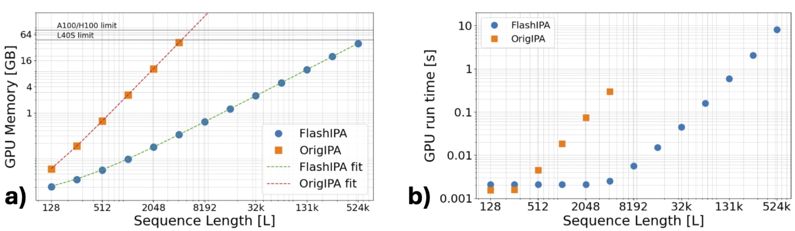

# Flash IPA 

Official implementation of Flash IPA, which enhances the efficiency of the IPA module. Our module **reduces training and inference time** and **memory requirements** of standard models. It also facilitates training on **longer sequences exceeding 10,000 in length**.



## How to use Flash IPA?

After following the setup guide, Flash IPA can be integrated into any model using the IPA module by replacing any original IPA layer with our implementation. The primary input difference from the standard IPA module is the **z_factor**, which represents a memory-efficient graph edge embedding. A complete example of an IPA model is provided in [model.py](src/flash_ipa/model.py), including the full computation of the **z_factor**.


### Flash IPA Model
```python
from flash_ipa.ipa import IPAConfig
from flash_ipa.model import Model, ModelConfig
import torch

DEVICE = torch.device("cuda" if torch.cuda.is_available() else "cpu")

B, L, D = 1, 32, 256
ipa_conf = IPAConfig(use_flash_attn=True, attn_dtype="bf16")
model_conf = ModelConfig(mode="flash_1d_bias", ipa=ipa_conf)
model = Model(model_conf)
model.to(DEVICE)
batch = {
    "node_embeddings": torch.rand(B, L, D).to(DEVICE),
    "translations": torch.rand(B, L, 3).to(DEVICE),
    "rotations": torch.rand(B, L, 3, 3).to(DEVICE),
    "res_mask": torch.ones(B, L).to(DEVICE),
}
output = model(batch)
```


### Flash IPA
```python
from flash_ipa.ipa import InvariantPointAttention, IPAConfig

ipa_conf = IPAConfig(use_flash_attn=True, attn_dtype='bf16')
ipa_layer = InvariantPointAttention(ipa_conf)
ipa_embed = ipa_layer(
    node_embed,
    None,
    z_factor_1,
    z_factor_2,
    curr_rigids,
    mask=node_mask
)
```

### Original IPA
```python
from flash_ipa.ipa import InvariantPointAttention, IPAConfig
from dataclasses import dataclass

ipa_conf = IPAConfig(use_flash_attn=False, attn_dtype='fp32')
ipa_layer = InvariantPointAttention(ipa_conf)
ipa_embed = ipa_layer(
    node_embed,
    edge_embed,
    None,
    None,
    curr_rigids,
    mask=node_mask
)
```

## Setup Guide

To manage environments efficiently, we use [uv](https://docs.astral.sh/uv/getting-started/installation/#standalone-installer). It simplifies managing dependencies and executing scripts.

### As a python package in your uv environement
```bash
uv add "flash_ipa @ git+https://github.com/anonymous/flash_ipa"
```

### For developement
```bash
git clone https://github.com/anonymous/flash_ipa
cd flash_ipa
uv sync
```


## License

This project is licensed under MIT License. See [LICENSE](LICENSE.txt) for more details.

## Citation

``` bash 
@article{liu2025flashipa,
  title={Flash Invariant Point Attention},
  author={Liu, Andrew and Elaldi, Axel and Franklin, Nicholas T and Russell, Nathan and Atwal, Gurinder S and Ban, Yih-En A and Viessmann, Olivia},
  journal={arXiv preprint arXiv:2505.11580},
  year={2025},
  url={https://arxiv.org/abs/2505.11580}
}
```
